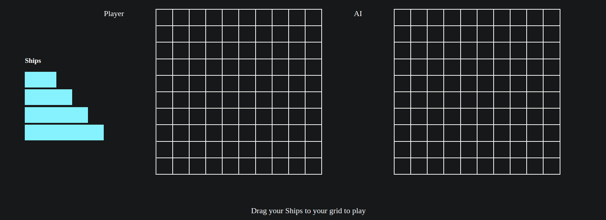

## Battleship the game
https://dashboard.heroku.com/apps/battleship-react-app

##Motivation 
Created the project as a part of [theodinproject.com](https://www.theodinproject.com/courses/javascript/lessons/battleship?ref=lnav) cirriculm. With the goal of having testing through Jest framework
)

##Screenshots

##Tech/Framework
**Built with**
- React
- Jest for testing
- Javascript/CSS/HTML

##Features
A completely playable version of the Battleship game
